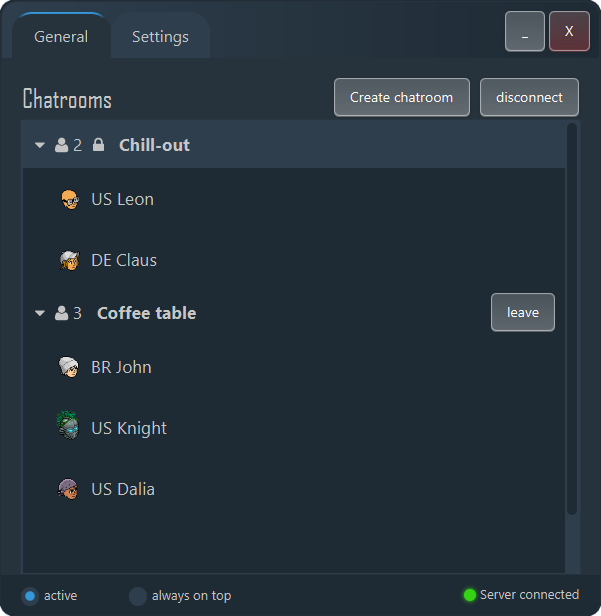

#  Chatty

Private end-to-end encrypted in-game Habbo chat.
Create private chatrooms and send end-to-end encrypted messages via a private server.

Chatty allows you to exchange end-to-end encrypted messages **using the chat of the original Habbo Client**, without sending any packet to the Habbo servers. You can talk to other Chatty users cross-hotel and cross-room, and only your friends who know the password can read your messages.

## How to use Chatty?

 When starting the chatty client, by default it will automatically connect to our Chatty server but you can also [host your own server](#Host-your-own-Chatty-server) and connect to it in the settings tab. In the bottom right of the Chatty client you can check if the connection to the Chatty server was successful.

 Inside the UI you see all available Chatty chatrooms and the Habbos inside it. You can either join a chatroom or create your own.

- Joining
  - Double click a chatroom to join it, you might have to enter a password.
  - You will now receive all messages that are being sent from Habbos in this chatroom
- Creating
  - To create a chatroom, click the button and enter a chatroom name and a password (optional)
  - Tell your friends the password so that they can join the room

At the bottom left you can activate or deactivate the Chatty client. When activated all your sent messages in Habbo will be redirected to the Chatty server and broadcastet to the chatroom you are member of. When deactivated, your messages are sent to the Habbo server like usual but you will still receive all the messages that are being sent inside the Chatty chatroom.
  
## Core features

- Secretly chat within the Habbo client
- End-to-end encrypted
- Hashed chatroom passwords
- Chatting cross-room and cross-hotel
- Communicate with other Chatty users without Habbo knowing

## How it works

Your sent chat messages inside the Habbo client get encrypted and redirected to the chatty server and then broadcasted to the Habbos inside the chatroom you are member of. The Chatty server itself does not store any data nor does the Habbo server receive any messages.

## Host your own Chatty server

To host your own Chatty server, you can look at the [server implementation](https://github.com/Gitosaur/ChattyServer). Inside there is a Dockerfile to easily run your own server. By default it exposes a websocket server on port 8000.
